  

  
  
  
  
  

<h2 align="center">📟 Terminal Session</h2>

  

<h2 align="center">📂 Featured Projects</h2>

<table align="center">
  <tr>
    <td align="right" valign="top" width="150">🧩 <b><a href="https://github.com/asckaya/CacheFlux">CacheFlux</a></b></td>
    <td align="left" valign="top" width="507">Reinforcement-learning + DNN + linear-programming scheduler for massive edge-cloud nodes. Deployed in production at Baishanyun Tech — near-optimal high-dimensional scheduling in under a minute. <code>Python</code> <code>Reinforcement Learning</code> <code>DNN</code> <code>Linear Programming</code></td>
  </tr>
  <tr>
    <td align="right" valign="top">🧠 <b><a href="https://github.com/asckaya/ai4mbse">AI4MBSE</a></b></td>
    <td align="left" valign="top">LLM + Neo4j knowledge graph for MBSE. Auto-extracts requirement / function / structure triplets from documents and SysML models, with RAG Q&amp;A over CLI, REST API and Web UI. <code>Python</code> <code>LLM</code> <code>Knowledge Graph</code> <code>Neo4j</code> <code>FastAPI</code> <code>SysML</code></td>
  </tr>
</table>

<h2 align="center">🚀 Core Focus</h2>

  
  
  

<h2 align="center">🛠️ Tech Stack</h2>

<table align="center">
  <tr>
    <td align="left" width="150"><code>languages</code></td>
    <td align="center" width="507">
      
      
      
      
    </td>
  </tr>
  <tr>
    <td align="left"><code>ai / ml</code></td>
    <td align="center">
      
      
      
    </td>
  </tr>
  <tr>
    <td align="left"><code>system</code></td>
    <td align="center">
      
      
      
    </td>
  </tr>
  <tr>
    <td align="left"><code>frontend</code></td>
    <td align="center">
      
      
      
      
    </td>
  </tr>
</table>

<h2 align="center">🔗 Connect With Me</h2>

  
  
  
  

  

